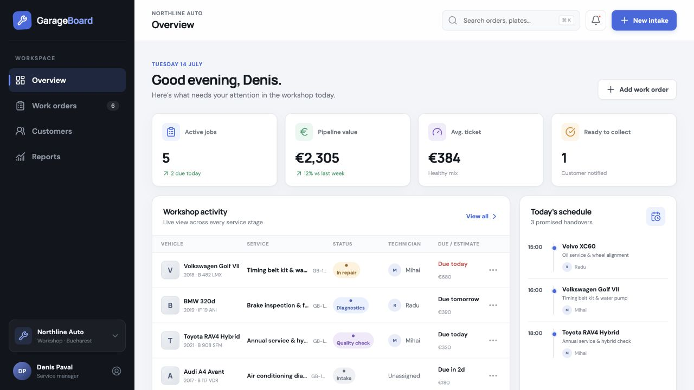
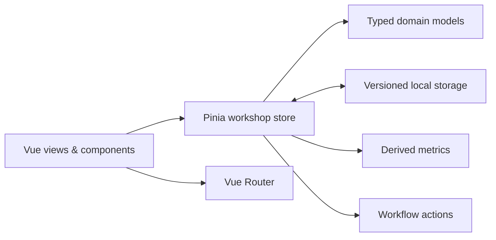

# GarageBoard

> A focused workshop operations dashboard built with Vue 3, TypeScript and Pinia.



GarageBoard turns the daily service-desk workflow into one clear workspace: see what is due, find any vehicle, create a validated intake, assign a technician and move the job from arrival to collection.

This is a portfolio project with realistic demonstration data. It does not claim a connection to a real garage, accounting platform or customer database.

**[Open the live dashboard](https://ciokapick.github.io/garage-board/)**

## What you can do

- Scan live workshop metrics, today's promised handovers and technician capacity.
- Search by work-order ID, customer, vehicle, registration or service.
- Filter the work-order list by stage and urgent priority.
- Open a complete job drawer, assign a technician and advance or reverse its stage.
- Create a new intake with a two-step, validated form.
- Keep changes between browser sessions through local storage.
- Browse customer history and a clearly labelled demo reporting view.
- Export the technician report as CSV.
- Use the complete experience on desktop, tablet and mobile layouts.

## Product thinking

The interface is designed around three service-manager questions:

1. **What needs attention now?** The overview prioritises active jobs, due dates and workshop capacity.
2. **Where is this vehicle?** Search and stage filters reduce the path to a work order to seconds.
3. **What is the next action?** The detail drawer keeps assignment, progress and stage controls together.

The visual system deliberately avoids a generic admin-template look: compact typography, restrained colour, high information density and strong status semantics suit a real service desk.

## Tech stack

| Area | Choice | Why |
| --- | --- | --- |
| UI | Vue 3 Composition API + `<script setup>` | Concise, strongly typed components |
| State | Pinia | Centralised derived metrics and workflow actions |
| Routing | Vue Router | Lazy-loaded, shareable application views |
| Types | TypeScript in strict mode | Safer domain models and form payloads |
| Icons | Lucide Vue | Consistent accessible SVG icon system |
| Testing | Vitest + jsdom | Fast coverage of workflow state transitions |
| Tooling | Vite 8 + ESLint | Fast builds and enforceable quality checks |

## Architecture



The store owns work-order transitions and assignments. Views consume computed data; they do not duplicate workflow rules. Persistence is intentionally local for this front-end demonstration, and the storage key is versioned so a future schema can migrate safely.

More implementation rationale is recorded in [docs/DECISIONS.md](docs/DECISIONS.md).

## Run locally

Requirements: Node.js 22.12+ and npm.

```bash
git clone https://github.com/Ciokapick/garage-board.git
cd garage-board
npm install
npm run dev
```

Open the local URL printed by Vite.

## Quality checks

```bash
npm run test       # workflow/store tests
npm run typecheck  # strict Vue + TypeScript check
npm run lint       # JavaScript, TypeScript and Vue lint
npm run build      # production build
npm audit          # dependency audit
```

The repository also contains GitHub Actions workflows that run tests, linting, type checking and the production build on every push and pull request, then deploy the verified `main` build to GitHub Pages.

## Implemented scope

GarageBoard is a client-side demonstration. Work orders created in the intake form are persisted in the current browser. Authentication, multi-user sync, notifications, invoicing and external integrations are intentionally not represented as implemented features.

A production evolution would introduce an API and database, role-based access, optimistic concurrency, audit history and background notification jobs while preserving the same domain model.

## Author

Designed and built by **Denis Paval** — [GitHub](https://github.com/Ciokapick) · [Lumax](https://lumax.agency)

## License

[MIT](LICENSE)
